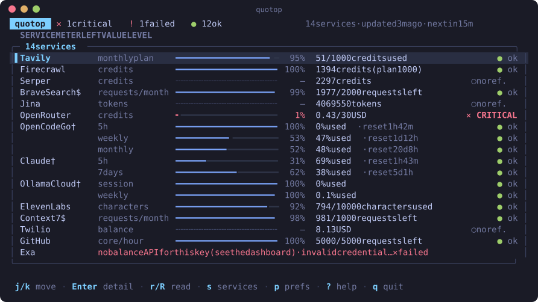

<div align="center">

# quotop

**Every API balance, credit and quota you pay for — in one terminal screen.**

[](https://github.com/SyscallBrain/quotop/actions/workflows/ci.yml)
[](LICENSE)
[](https://www.rust-lang.org)



</div>

If you use a handful of AI and developer APIs, you know the drill: OpenRouter
credits in one dashboard, the Claude 5-hour window in another, Tavily and
ElevenLabs usage somewhere else — and you only find out one of them ran dry when
a request fails. **quotop** reads them all, read-only, and shows what is left of
each limit, what is about to run out and when it resets. Like `htop`, but for
your API quotas.

- **26 services** out of the box: LLM providers, search APIs, subscriptions and
  more ([full list](#supported-services)).
- **One glance**: a bar per limit with what *remains*, the exact value, and a
  traffic light that only lights up when something needs attention.
- **Read-only and careful with keys**: keys are never shown, logged or written
  to the cache, and refreshes never spend paid quota unless you ask
  ([security](#security)).
- **Scriptable**: `quotop --json` prints the same data for your own scripts and
  alerts.
- **Yours to shape**: pick which services appear, 8 colour themes, 3 bar
  styles, per-service thresholds, English and Portuguese (with room for more).

## Contents

- [Installation](#installation)
- [Quick start](#quick-start)
- [Using quotop](#using-quotop)
- [Supported services](#supported-services)
- [API keys](#api-keys)
- [Configuration](#configuration)
- [JSON output](#json-output)
- [Security](#security)
- [Languages](#languages)
- [Limitations](#limitations)
- [Contributing](#contributing)
- [License](#license)

## Installation

quotop is a single binary written in Rust. It runs on Linux and macOS.

**With Cargo** (Rust 1.88 or newer):

```sh
cargo install --git https://github.com/SyscallBrain/quotop
```

**From source**:

```sh
git clone https://github.com/SyscallBrain/quotop
cd quotop
cargo install --path .
```

Both put `quotop` in `~/.cargo/bin`, which `rustup` adds to your `PATH`.

## Quick start

1. **Give quotop your keys.** Either export them as environment variables, or
   put them in `~/.config/quotop/keys.env`, one per line:

   ```sh
   mkdir -p ~/.config/quotop
   touch ~/.config/quotop/keys.env
   chmod 600 ~/.config/quotop/keys.env   # quotop refuses to read it otherwise
   ```

   ```dotenv
   OPENROUTER_API_KEY=sk-or-...
   TAVILY_API_KEY=tvly-...
   ```

   You can also type keys inside quotop: press `s`, pick a service and press
   `a` (see [Services & keys](#services--keys)).

2. **Run it:**

   ```sh
   quotop
   ```

   The first refresh starts right away and readings appear as they arrive
   (usually within two seconds). Only services that have a key are shown.

## Using quotop

### The main screen

Each row is one limit of one service: the service, the name of the limit, a bar
with the fraction that **remains** (full = plenty left), the exact value and a
level on the right. Services with two limits (Claude's 5-hour and 7-day windows,
for example) take two rows. The header sums up how many services are critical,
in warning, failing, fine or without data.

| Mark | Meaning |
| --- | --- |
| `$` | Reading this service costs one request of its own quota, so automatic refreshes skip it (press `r` or `R` to read it). |
| `†` | The service has no official usage API; quotop uses an undocumented endpoint that may change without notice. |

| Level | Meaning |
| --- | --- |
| `● ok` | Above the warning threshold. |
| `▲ WARNING` | Less than 20 % of the limit left (default). |
| `✕ CRITICAL` | Less than 5 % left (default). |
| `✕ DEPLETED` | Nothing left. |
| `○ no ref.` | A balance with no known limit, so there is no fraction to judge it by. Set a [threshold](#thresholds) to get a level. |

A row without numbers shows the status of its reading instead: `no credential`
(with the variable that is missing), `invalid credential (401)`,
`rate limited (429)`, `API error`, `network error`, `unexpected format` (the
response changed shape), `no balance API` (the service only shows usage on its
dashboard), and so on. When a refresh fails, the last good values stay on
screen.

quotop refreshes on start and then every 15 minutes (configurable). Automatic
refreshes only read free endpoints, and a service read less than 60 seconds ago
is not read again.

### Keys

| Key | Action |
| --- | --- |
| `j` / `k`, `↓` / `↑` | Move the selection |
| `g` / `G` | First / last row |
| `Enter`, `l` | Detail panel for the selected service |
| `Esc`, `h` | Back to the list |
| `r` | Read the selected service now (including `$` services) |
| `R` | Read everything now (including `$` services) |
| `f` | Hide / show rows without numbers |
| `s` | Services & keys: choose what appears, type a key |
| `p` | Preferences: language, theme, bar style |
| `?` | Help |
| `q`, `Ctrl+C` | Quit |

### Detail panel

`Enter` opens everything a row has no room for: every meter with its exact
values, reset times in your local time zone, the service's category, class and
cost, the endpoint (without its query string, so a screenshot never leaks a
key), the dashboard URL, the expected variables, the thresholds in force, the
last error and how long the request took.

### Services & keys

Press `s` to see all 26 services, their category, and whether a key was found
(`✓`) or is missing (`·`).

- `space` toggles whether the service appears on the main screen. By default a
  service appears when it has a key, so adding a key to `keys.env` makes it show
  up by itself; the screen only remembers the exceptions you choose (marked
  "your choice"). Hidden services are not read at all.
- `a` lets you type a key for the selected service. What you type is never
  displayed — only `•` and the number of characters. `Enter` writes it to your
  key file (the first entry of [`key_files`](#configuration), by default
  `~/.config/quotop/keys.env`) with permissions `600`, changing only that
  variable's line; quotop then reloads the keys and reads the service. Twilio
  asks for its two variables one after the other.

### Preferences

Press `p` to change the **language** (`l`), the **theme** (`j`/`k`) and the
**bar style** (`b`). Changes apply live; `Enter` saves them to
`~/.local/state/quotop/preferences.toml` and `Esc` restores what you had.

Themes: Tokyo Night (default), Catppuccin Mocha, Catppuccin Latte (light),
Gruvbox, Nord, Dracula, Rosé Pine, and Terminal (your terminal's own colours).
Bar styles: `line` (`━━━━╸━━`), `blocks` (`███▌░░`) and `dots` (`⣿⣿⣿⡇⣀⣀`).

## Supported services

| Service | id | Category | What it reports | Reading costs | Key |
| --- | --- | --- | --- | --- | --- |
| Tavily | `tavily` | Search | usage vs limit | free | `TAVILY_API_KEY` |
| Firecrawl | `firecrawl` | Search | exact balance | free | `FIRECRAWL_API_KEY` |
| Exa | `exa` | Search | no balance API | free | `EXA_API_KEY` |
| Serper | `serper` | Search | exact balance | free | `SERPER_API_KEY` |
| Brave Search `$` | `brave` | Search | rate limit only | 1 request | `BRAVE_API_KEY` |
| Jina | `jina` | Search | exact balance | free | `JINA_API_KEY` |
| OpenRouter | `openrouter` | LLM | exact balance | free | `OPENROUTER_API_KEY` |
| DeepSeek | `deepseek` | LLM | exact balance | free | `DEEPSEEK_API_KEY` |
| MiniMax | `minimax` | LLM | no balance API | free | `MINIMAX_API_KEY` |
| xAI | `xai` | LLM | exact balance | free | `XAI_MANAGEMENT_KEY` |
| Groq | `groq` | LLM | no balance API | free | `GROQ_API_KEY` |
| Gemini | `gemini` | LLM | no balance API | free | `GOOGLE_API_KEY` |
| Mistral | `mistral` | LLM | no balance API | free | `MISTRAL_API_KEY` |
| Cerebras | `cerebras` | LLM | no balance API | free | `CEREBRAS_API_KEY` |
| Ollama Cloud `†` | `ollama` | LLM | usage vs limit | free | `OLLAMA_API_KEY` |
| OpenCode Go `†` | `opencode_go` | Subscriptions | usage vs limit | free | `OPENCODE_GO_API_KEY` |
| Claude `†` | `claude` | Subscriptions | usage vs limit | free | Claude Code login |
| ElevenLabs | `elevenlabs` | Other | usage vs limit | free | `ELEVENLABS_API_KEY` |
| Deepgram | `deepgram` | Other | exact balance | free | `DEEPGRAM_API_KEY` |
| fal.ai | `fal` | Other | exact balance | free | `FAL_KEY` |
| Composio | `composio` | Other | usage vs limit | free | `COMPOSIO_API_KEY` |
| Context7 `$` | `context7` | Other | rate limit only | 1 request | `CONTEXT7_API_KEY` |
| Twilio | `twilio` | Other | exact balance | free | `TWILIO_ACCOUNT_SID`, `TWILIO_AUTH_TOKEN` |
| Pushover | `pushover` | Other | usage vs limit | free | `PUSHOVER_APP_TOKEN` |
| GitHub | `github` | Other | rate limit only | free | `GITHUB_TOKEN` |
| X API | `x` | Other | usage vs limit | free | `X_BEARER_TOKEN` |

**What it reports**: *exact balance* is an amount left; *usage vs limit* is how
much of a limit was used; *rate limit only* means the service has no balance,
only a request ceiling; *no balance API* means the key can't see the balance —
only the service's dashboard can, and the row says so instead of guessing.

Notes on a few services:

- **xAI** needs a *management* key (`XAI_MANAGEMENT_KEY`), not the regular
  `XAI_API_KEY`.
- **Claude** uses the login of [Claude Code](https://claude.com/claude-code)
  (`~/.claude/.credentials.json`). quotop only reads the access token; it never
  refreshes or rewrites that file. When the token expires, open Claude Code to
  renew it.
- **OpenCode Go** also works with the key OpenCode stores in
  `~/.local/share/opencode/auth.json`.

Missing a service you use? [Adding one](CONTRIBUTING.md#adding-a-service) is
usually a single small file.

## API keys

quotop looks for each variable in this order, and the first non-empty value
wins:

1. environment variables;
2. the files listed in [`key_files`](#configuration), in order (by default only
   `~/.config/quotop/keys.env`);
3. the files of two tools: `~/.local/share/opencode/auth.json` (OpenCode Go)
   and `~/.claude/.credentials.json` (Claude).

Key files use the usual `.env` format: `NAME=value` or `export NAME=value`,
optional quotes around the value, blank lines and `#` comments. **A key file
that group or others can read is not read at all** — quotop tells you which
file, and the `chmod 600` to run.

Only variables whose names look like credentials (containing `KEY`, `TOKEN`,
`SECRET`, `SID` or `PASS`) are loaded, so pointing `key_files` at another tool's
`.env` doesn't pull in unrelated settings.

## Configuration

Everything works without a configuration file. To change something, copy
[`config.example.toml`](config.example.toml) to `~/.config/quotop/config.toml`
and edit it:

| Key | Default | Meaning |
| --- | --- | --- |
| `language` | `"en-US"` | Interface language: `en-US` or `pt-PT`. |
| `interval_min` | `15` | Minutes between automatic refreshes; `0` turns them off. |
| `timeout_s` | `10` | Timeout of each request, in seconds. |
| `key_files` | `["~/.config/quotop/keys.env"]` | `.env` files with keys, in order of precedence. The Services screen writes to the first one. |
| `disabled` | `[]` | Service ids to remove completely (not read, not listed). |
| `theme` | `"tokyo-night"` | Colour theme id. |
| `bar` | `"line"` | Bar style: `line`, `blocks` or `dots`. |
| `[colors]` | — | Override single theme colours ([below](#colours)). |
| `[thresholds.<id>]` | — | Per-service thresholds ([below](#thresholds)). |
| `claude_user_agent` | `"claude-code/2.1.282"` | User-Agent for Claude's usage endpoint. |

An unknown key is a warning, shown at the bottom of the screen; invalid TOML or
a value of the wrong type makes quotop refuse to start, printing the line of the
error. Choices saved in the Preferences screen take precedence over `language`,
`theme` and `bar`.

### Thresholds

By default a meter turns **WARNING** below 20 % of its limit and **CRITICAL**
below 5 %. For a specific service you can set thresholds in the meter's own
unit instead — which is also how a balance without a known limit gets a level:

```toml
[thresholds.openrouter]
warn_below = 5.0        # USD
critical_below = 1.0

[thresholds.jina]
warn_below = 1000000.0  # tokens
```

### Colours

Any colour of the current theme can be replaced, as `#rrggbb` or `reset` (the
terminal's own colour). The roles are `background`, `text`, `muted`, `border`,
`accent`, `selection`, `ok`, `warning`, `error`, `bar` and `track`.

```toml
theme = "catppuccin-mocha"

[colors]
bar = "#94e2d5"        # teal bars instead of blue
background = "reset"   # transparent background
```

### Files

| Path | What |
| --- | --- |
| `~/.config/quotop/config.toml` | Your configuration (quotop never writes it). |
| `~/.config/quotop/keys.env` | Default key file. |
| `~/.local/state/quotop/preferences.toml` | Language, theme and bar chosen in the Preferences screen. |
| `~/.local/state/quotop/services.toml` | Services shown or hidden in the Services screen. |
| `~/.cache/quotop/last.json` | The last readings, shown at the next start while the first refresh runs. Safe to delete. |

On macOS the state and cache files live under `~/Library/Application Support`
and `~/Library/Caches`.

## JSON output

```sh
quotop --json                 # free services only
quotop --json --include-paid  # also the `$` services (one request each)
```

`--json` reads every configured service once and prints the result on stdout,
in the same structure as the cache:

```json
{
  "version": 2,
  "generated_at": "2026-09-26T11:53:04Z",
  "readings": [
    {
      "provider": "openrouter",
      "service": "OpenRouter",
      "category": "llm",
      "class": "exact_balance",
      "cost": "free",
      "read_at": "2026-09-26T11:53:04Z",
      "duration_ms": 412,
      "status": { "kind": "ok" },
      "meters": [
        {
          "label": "credits",
          "unit": "currency",
          "currency": "USD",
          "used": 29.57,
          "limit": 30.0,
          "remaining": 0.43,
          "resets_at": null,
          "level": "critical"
        }
      ]
    }
  ]
}
```

Levels are `ok`, `warning`, `critical`, `exhausted` and `no_reference`. A failed
reading has a `status.kind` of `no_credential`, `invalid_credential`,
`expired_credential`, `rate_limited`, `api_error`, `network_error`,
`unexpected_format` or `unsupported`. JSON output is always in English,
whatever the interface language.

Exit codes: `0` success; `1` the result could not be written to stdout; `2`
usage or configuration error, or output refused by the leak guard (see below).
Without an interactive terminal, plain `quotop` exits with `2` and suggests
`--json`.

## Security

quotop handles API keys, so it is built to keep them out of sight:

- **Read-only.** It only calls usage and balance endpoints; it never creates,
  spends or changes anything on your accounts (the two `$` services use up one
  request of their own quota per read, and only when you ask).
- **Keys stay in memory.** Values live in a `Secret` type that prints as a
  placeholder, can't be serialised, and is only exposed to build the HTTP
  request.
- **A leak guard** masks any key found in an error message coming back from an
  API, and refuses to write the cache or the `--json` output if a key would
  appear in it.
- **No keys on screen.** Endpoints are shown without their query string, typed
  keys are masked, and nothing is logged.
- **File permissions.** Key files readable by group or others are ignored with a
  warning; files quotop writes are created with mode `600`.
- **Other tools' credentials are left alone.** Claude Code's and OpenCode's
  files are only read, and the Claude token is never refreshed.

Found a security problem? Please report it privately — see
[SECURITY.md](SECURITY.md).

## Languages

quotop speaks **English** (default) and **Portuguese (Portugal)**. Switch with
`p` then `l`, or set `language = "pt-PT"` in `config.toml`.

Translations are plain TOML files in [`locales/`](locales). Adding a language
means copying `locales/en-US.toml`, translating the values and adding one line
to `src/i18n.rs` — see
[CONTRIBUTING.md](CONTRIBUTING.md#adding-a-language). The test suite checks
that every language has all the keys.

## Limitations

- Three services have **no official usage API** (Claude, OpenCode Go and Ollama
  Cloud); their undocumented endpoints may change without notice. When that
  happens only that row turns into `unexpected format`, and the tests built on
  real responses catch it first.
- Some response formats were written from the providers' documentation rather
  than a live account (DeepSeek, Deepgram, fal.ai and Pushover), and Composio
  and xAI stay `unsupported` until their endpoints are confirmed. Reports from
  users of those services are very welcome.
- Money is only displayed — never added up across services or currencies.
- No history, charts or notifications yet; use `--json` from a script if you
  need alerts.
- Linux and macOS only (Windows is untested).

## Contributing

Bug reports, new services and translations are all welcome. Start with
[CONTRIBUTING.md](CONTRIBUTING.md): it explains the project layout, how to run
the tests, and has step-by-step guides to add a service or a language.

## License

[MIT](LICENSE) © 2026 SyscallBrain
